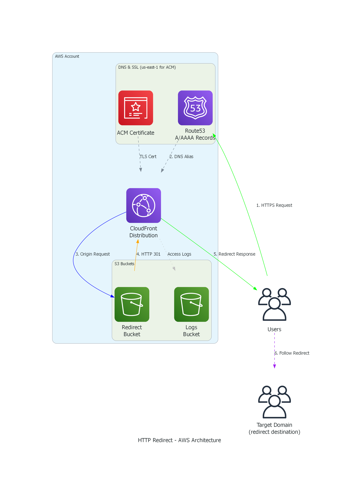
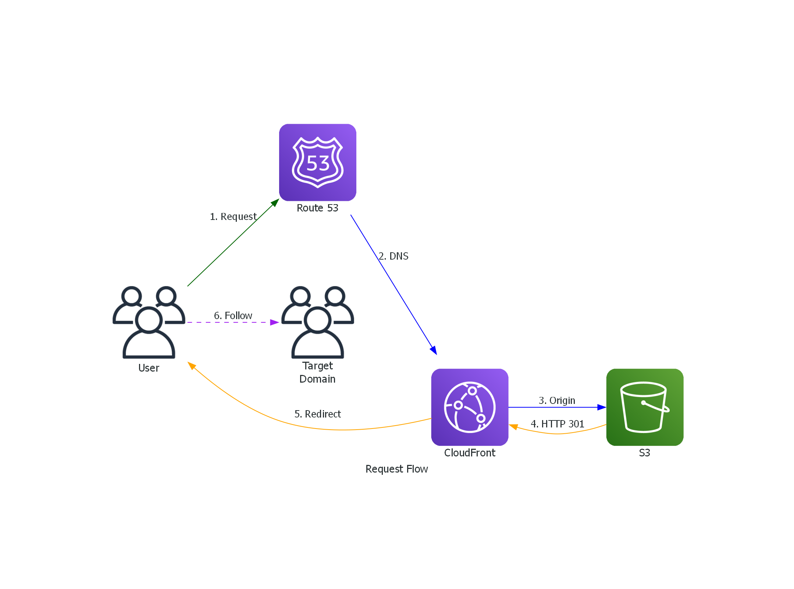
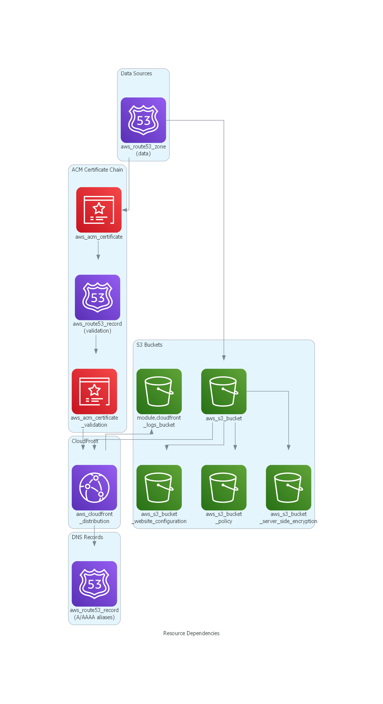

# Architecture

This page explains how the terraform-aws-http-redirect module works internally.

## Architecture Diagram



## Component Overview

### Route 53

Route 53 provides DNS resolution for redirect domains:

- **A Records**: IPv4 aliases pointing to CloudFront
- **AAAA Records**: IPv6 aliases pointing to CloudFront
- **CAA Records**: Certificate Authority Authorization for ACM

The module creates DNS records for each hostname in `redirect_hostnames`, computed against
the hosted zone.

### ACM Certificate

ACM (AWS Certificate Manager) provides the TLS certificate for HTTPS:

- **Region**: Must be in `us-east-1` (CloudFront requirement)
- **Validation**: DNS validation using Route 53 records
- **Coverage**: Single certificate covers all redirect hostnames

The module automatically:

1. Creates the certificate request
2. Creates DNS validation records in Route 53
3. Waits for certificate validation

### CloudFront Distribution

CloudFront serves as the entry point for all requests:

- **TLS Termination**: Handles HTTPS using the ACM certificate
- **HTTP to HTTPS**: Forces all HTTP requests to HTTPS
- **Caching**: Caches redirect responses (301s are cacheable)
- **Security Headers**: Adds HSTS, X-Frame-Options, etc.
- **WAF Integration**: Optional AWS WAF attachment

**Configuration highlights:**

```hcl
viewer_protocol_policy = "redirect-to-https"  # Force HTTPS
price_class           = var.cloudfront_price_class
web_acl_id            = var.web_acl_id  # Optional WAF
```

### S3 Bucket (Redirect Origin)

S3 provides the actual redirect logic via website hosting:

- **Website Hosting**: Enabled for redirect functionality
- **Routing Rules**: Define redirect behavior
- **Encryption**: Server-side encryption (AES256)
- **Access**: Blocked from public access (CloudFront only)

**Redirect configuration:**

```xml
<RoutingRules>
  <RoutingRule>
    <Redirect>
      <Protocol>https</Protocol>
      <HostName>target.com</HostName>
      <ReplaceKeyPrefixWith>path/</ReplaceKeyPrefixWith>
      <HttpRedirectCode>301</HttpRedirectCode>
    </Redirect>
  </RoutingRule>
</RoutingRules>
```

### S3 Logs Bucket (Optional)

Stores CloudFront access logs for compliance:

- **Enabled**: By default for ISO 27001/SOC 2 compliance
- **Retention**: Logs retained per your organization's policy
- **Format**: CloudFront standard log format

## Request Flow



### Detailed Request Flow

1. **User Request**: User visits `https://example.com/page?query=1`

2. **DNS Resolution**: Route 53 returns CloudFront distribution's domain

3. **TLS Handshake**: CloudFront terminates TLS using ACM certificate

4. **Origin Request**: CloudFront forwards request to S3 website endpoint

5. **S3 Response**: S3 returns HTTP 301 with:
   ```
   Location: https://target.com/page?query=1
   ```

6. **CloudFront Response**: CloudFront returns 301 to user (caches response)

7. **Follow Redirect**: User's browser follows redirect to target domain

## Security Features

### TLS/SSL

- ACM certificate with automatic renewal
- TLS 1.2+ enforced by CloudFront
- HTTPS-only viewer protocol policy

### Security Headers

CloudFront adds these headers to all responses:

| Header | Value | Purpose |
|--------|-------|---------|
| Strict-Transport-Security | max-age=31536000 | Force HTTPS |
| X-Frame-Options | DENY | Prevent clickjacking |
| X-Content-Type-Options | nosniff | Prevent MIME sniffing |
| X-XSS-Protection | 1; mode=block | XSS filter |
| Referrer-Policy | strict-origin-when-cross-origin | Control referrer |

### S3 Security

- Public access blocked at bucket level
- SSL-only access enforced via bucket policy
- Server-side encryption (AES256)

## Cost Breakdown

| Resource | Cost Driver | Typical Monthly Cost |
|----------|------------|---------------------|
| CloudFront | Requests + data transfer | $1-10 |
| S3 Redirect Bucket | Minimal storage | < $0.01 |
| S3 Logs Bucket | Log storage | $0.05-0.50 |
| Route 53 Records | Query volume | $0.40/million |
| ACM Certificate | Free | $0 |

**Total estimated cost**: $1-15/month for low-traffic redirects

## Resource Dependencies



## Regenerating the Diagrams

The diagrams are generated using the Python `diagrams` library:

```bash
cd docs/assets
pip install diagrams
python architecture.py
python request_flow.py
python dependencies.py
```

This creates `architecture.png`, `request_flow.png`, and `dependencies.png` in the current directory.